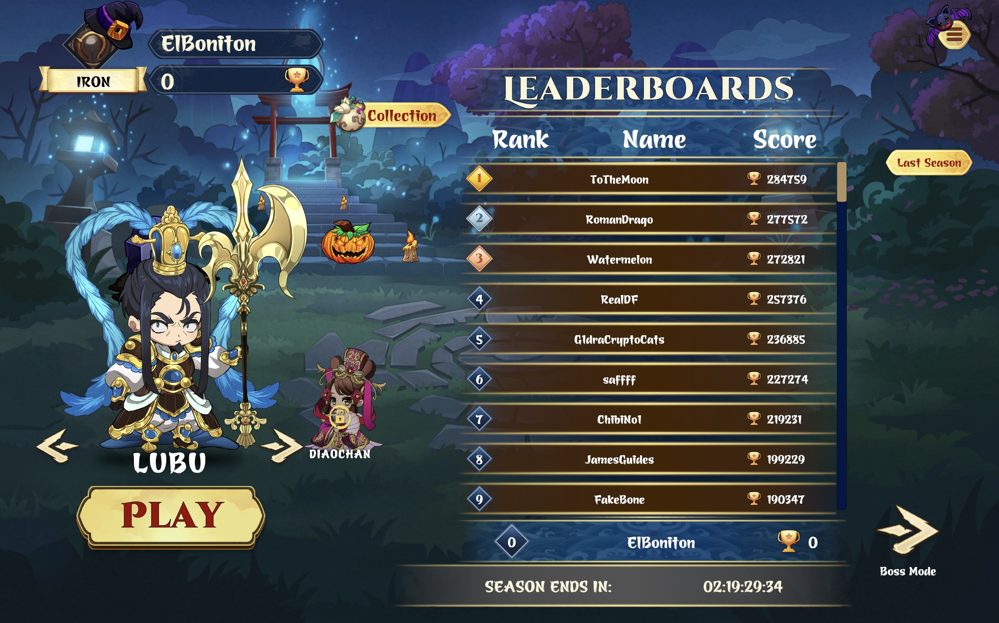
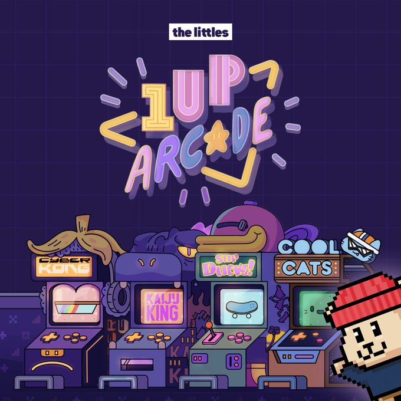
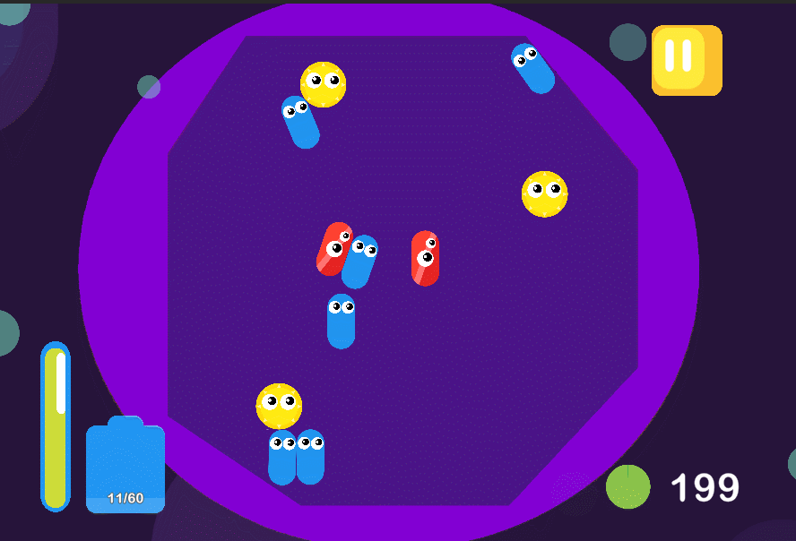

# Portfolio

## [Chibi Survivor Site](https://chibi.gg/sso?app=survivor)

2.5D survivor game developed in Unity3D for WebGl with a focus on performance optimization and engaging gameplay.

Will require Login to play.

&nbsp;

## [The Littles project site](https://playside.thelittles.io/arcade?near=portalFromArcadeToPlayside)

Developed the entire process for four additional Unity WebGL mini-games in partnership with The Littles within The Littles Playside Arcade, where the games revolve around purchasing NFTs to gain access.

&nbsp;

## [Itch.io](https://pctzonoes.itch.io/)

A collection of small games and prototypes I've made over the years. Some are made for game jams, as a student or others are just for fun.

### [Primordial Soup](https://dapperpenguin.itch.io/physics-game)

Primordial Soup is a 2d puzzle game that is inside a petri dish. The Player chooses a primal microbe and competes with other microbes for dominance inside the petri dish

&nbsp;

## [GitHub](https://github.com/PCtzonoes)

My GitHub profile with some of my projects and contributions to other projects.

  > [Mini engine](https://github.com/PCtzonoes/Minimal-Engine)  
  A small engine I made to learn more about game engines and how they work.  
  > [mini rogue](https://github.com/PCtzonoes/mini-rogue)  
  A small game I made for fun in pure Rust, has an WASM version to play in the browser.
